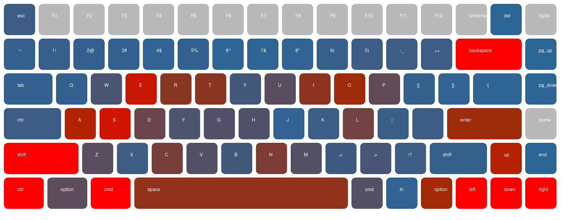

# Keyboard Heatmap

This heatmapper relies on a log file with the keystrokes from the keyboard.
To generate this file, I'm using a forked version of [caseyscarborough/keylogger](https://github.com/caseyscarborough/keylogger), that logs the key codes in a more controlled way to be parsed ([zediogoviana/keylogger](https://github.com/zediogoviana/keylogger)). It's simple to use, just follow the instructions. Nevertheless, you can use anything to collect your keystrokes as long as then you pass the right structure.

The idea is to generate an image of any keyboard layout, and for that, it's possible to add the configuration for new keyboard types and models, and then just choose the one we want to see "painted". It uses [zamith/mogrify_draw](https://github.com/zamith/mogrify_draw) to draw each key. 

See the rest of this README for more information.

Below you can see an example of a couple of days mapped in my Keychron k2v2 (with some custom changes, as a control in place of caps lock, for example).



*(man I must suck at writing code, with all that backspace usage...)*

## Available keyboard layouts

| Type       | Model     |
|------------|-----------|
| `keychron` | `k2v2`    |
| `niz`      | `micro82` |

## Creating new keyboard layouts

To create new keyboard layouts, add new modules if the keyboard type is new in `lib/layouts/` and then add the key in `lib/layouts.ex`. 

Or add new configurations inside the existing ones, being the name of the new function, the name of keyboard model.

The layout configuration, is a simple list, keyboard rows, and each row,is a list of keys (`%{size: <number>, keycode: <number>, name: <string>}`). If it's a white space, then pass `%{white_space: true, size: <number>}`. If you need to define a height for a key, instead of `size`, use `height` and `width`.

At the moment keyboards that have specific configurations to be painted (like vertical gaps, or keys with half the height - macbook arrow/media keys) don't work properly. Still need to work on it

[The keycode values for macOS](https://eastmanreference.com/complete-list-of-applescript-key-codes)

## Run and generate your heatmap

As mentioned above, you need to have a log file with your keystrokes. To generate an output image, just pass it as an argument., together with keyboard type and model, as described in the available layouts.

The output is a `heatmap.png` file.

- Generating an executable and running with args

```
$ mix escript.build
$ ./key_heatmap --file="keystroke.log" --type="keychron" --model="k2v2"
```

- Using `mix run`

```
$ mix run -e "KeyHeatmap.process(file: \"keystroke.log\", type: \"keychron\", model: \"k2v2\")"
```
